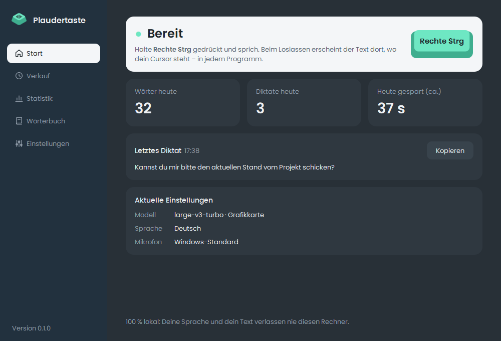
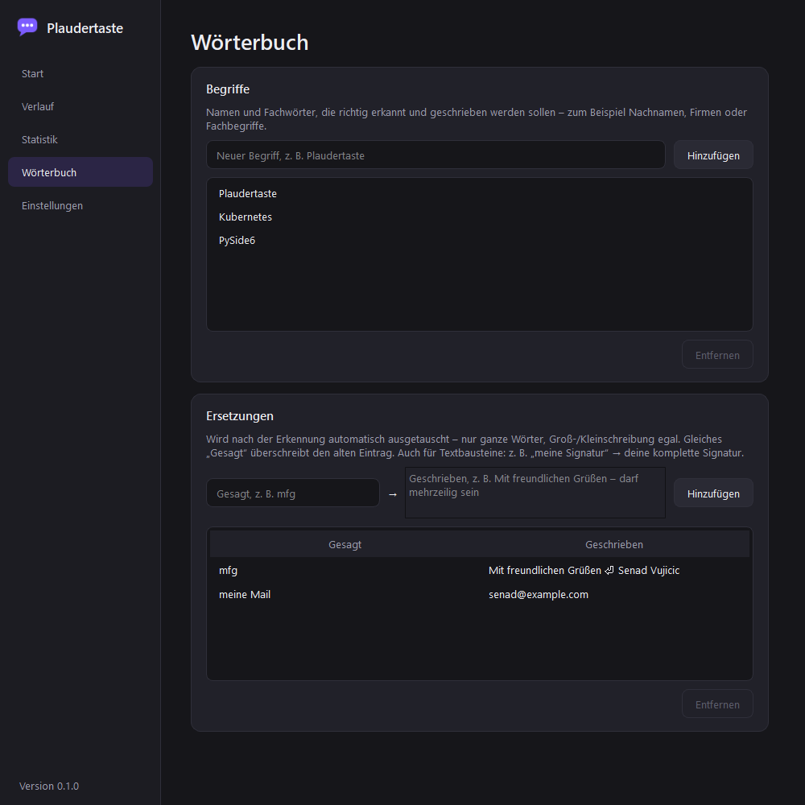
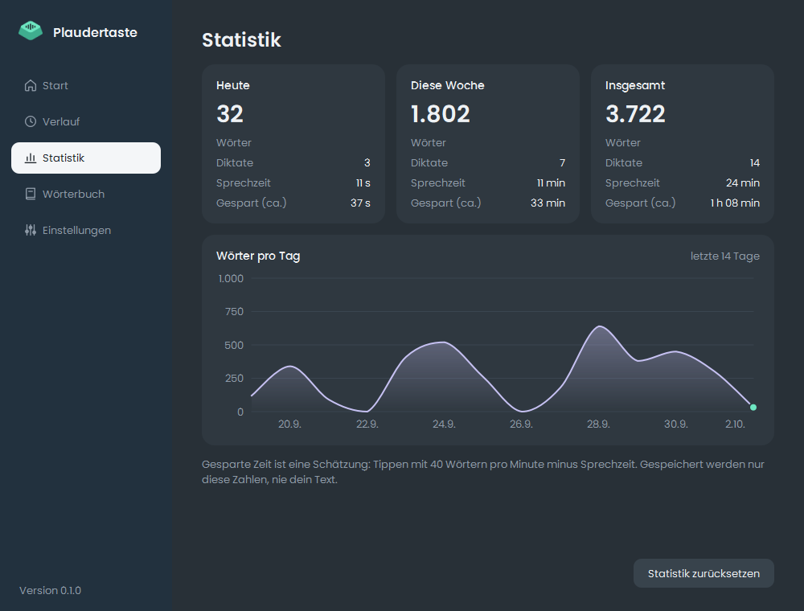
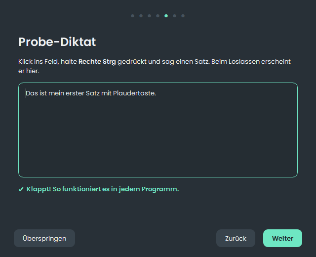

# Plaudertaste – offline voice typing for Windows, 100 % local

**Your voice stays on your computer.**<br>
Open source, no cloud, no account – and every connection verifiable.

<a href="https://github.com/senad-vujicic/plaudertaste/releases/latest/download/Plaudertaste-Setup.exe"></a><br>
<sub>One file, double-click to install · approx. 570 MB · Windows 10/11 (64-bit) · free ·
<a href="https://github.com/senad-vujicic/plaudertaste/releases">all versions</a></sub>

Plaudertaste is free push-to-talk dictation software for Windows with a focus on German:
hold a key, speak, release – the text appears wherever your cursor is, in Word, the browser,
Outlook or any chat. Speech recognition (speech-to-text with OpenAI's Whisper model) runs
offline and entirely on your PC. There is no server your recordings could be sent to – a
privacy-friendly alternative to cloud dictation services.

The app's user interface is in German. *Plaudertaste* is German for "chatter key".



🇩🇪 [Deutsche Version](README.md)

---

## Privacy you can verify

Many dictation tools send every recording to someone else's servers for recognition.
Plaudertaste doesn't – and since the complete source code is public, you don't have to take
that on trust: every promise below links to the code that implements it.

| Promise | In the code |
|---|---|
| **Your voice and text never leave your computer.** Recognition runs locally; there is no telemetry, no online usage statistics and no account. | [transcriber.py](src/plaudertaste/transcriber.py) |
| **No secret listening.** The microphone is only open during a recording – and during the microphone test in the setup wizard. | [recorder.py](src/plaudertaste/recorder.py) |
| **No dictated text on disk.** Recordings and history exist in memory only – gone when the app quits. Statistics store numbers only, the log file never stores content. | [history.py](src/plaudertaste/history.py), [stats.py](src/plaudertaste/stats.py), [app.py](src/plaudertaste/app.py) |
| **Not in clipboard history, not in the cloud.** Dictated text is marked so that Windows neither keeps it in clipboard history (Win+V) nor syncs it across devices. | [clipboard.py](src/plaudertaste/clipboard.py) |
| **Your keyboard is not recorded.** To detect the hotkey in every program, Plaudertaste sees key presses – it only checks whether it is your hotkey and whether you are typing. None are stored, logged or sent. | [hotkey.py](src/plaudertaste/hotkey.py) |
| **Only two destinations, both visible.** A network guard logs every connection; in offline mode it blocks them all. | [network.py](src/plaudertaste/network.py) |
| **Anonymous model download, pinned version.** No account or access token, and always exactly the reviewed version – a later change to the model repository never arrives unasked. | [model_download.py](src/plaudertaste/model_download.py), [models.py](src/plaudertaste/models.py) |

**The two connections** – Plaudertaste makes no others:

- **huggingface.co** (including its download servers) – only when a speech model is missing,
  usually once on first start.
- **api.github.com** – one request at start-up to check for a new version. Can be turned
  off; nothing is ever installed automatically.

### Check it yourself

1. **Network log:** *Settings → Privacy* (*Einstellungen → Datenschutz*) lists every
   connection of the current session.
2. **With Windows tools:** *Resource Monitor → Network* shows live what `Plaudertaste.exe`
   is connected to.
3. **Turn on offline mode:** after that nothing goes out – not even the update check.
4. **Read the code or build it yourself:** the installer is built from exactly this source
   with one command (see [Building the installer](#building-the-installer)).

### What Plaudertaste cannot prevent

Being honest includes this:

- **The target program receives your text.** If you dictate into a web app or cloud
  service, the text goes wherever that program sends it – just like typing.
- **GitHub and Hugging Face see your IP address** when Plaudertaste contacts them – as with
  any website visit. Offline mode prevents both.
- **Offline mode works inside Plaudertaste** and is not a replacement for a firewall.
- **If the clipboard held no text before** (e.g. an image), the dictated text stays in it
  afterwards – marked private, as a copy you can paste again.

All details – every stored file, every connection – are in [PRIVACY.md](PRIVACY.md) (German
with an English summary). Found a security issue? Please report it privately, see
[SECURITY.md](SECURITY.md).

## Open source – completely

- **MIT license:** use, inspect, modify and share – commercially too.
- **Everything is open:** app, tests, build scripts and installer script are in this
  repository. The only closed component is NVIDIA's GPU library cuBLAS, bundled for GPU
  acceleration.
- **Traceable:** more than 380 automated tests, and the reasons behind the design are
  documented with measurements in [docs/entscheidungen.md](docs/entscheidungen.md) (German).
- **Audited dependencies:** all libraries are checked for known vulnerabilities with
  [pip-audit](https://pypi.org/project/pip-audit/) (as of 2 Oct 2026: none found).

## Features

- **Dictate into any program** – text is pasted via the clipboard, whose previous text is
  restored afterwards.
- **Configurable hotkey** – the default is the right Ctrl key.
- **Hands-free mode** – tap twice, then speak without holding the key.
- **Undo last dictation** – hold the hotkey + Backspace.
- **Custom dictionary** – technical terms and names as hints for recognition, plus
  replacements (e.g. "mfg" → a full letter closing, multi-line allowed).
- **Voice commands** (German) – "neue Zeile" (new line), "neuer Absatz" (new paragraph),
  "Komma", "Fragezeichen", "Ausrufezeichen", "Doppelpunkt".
- **Filler removal** – German fillers like "äh", "ähm", "öhm", "hm" are removed automatically.
- **Feedback** – key-shaped tray icon (mint = ready, pink = recording,
  lavender = processing), a short tone and a small overlay with level
  and recording time; all optional.
- **Main window** with status, history of recent dictations, statistics (with a chart of
  the last 14 days) and settings.
- **Setup wizard** on first start: test the microphone, pick a hotkey, try a dictation.
- **Offline mode** – blocks every internet connection of the app.
- **About 100 languages** (everything Whisper supports) – tested and tuned for German.





## Installation

1. **[Download Plaudertaste-Setup.exe](https://github.com/senad-vujicic/plaudertaste/releases/latest/download/Plaudertaste-Setup.exe)**
   (about 570 MB) – the only file you need. The "Source code" entries on the release page
   are for developers only.
2. Double-click the downloaded file. The setup installs for your user account only and
   needs **no admin rights**.
3. On first start a wizard guides you through the setup. The speech model
   (0.5–1.6 GB depending on your computer) is downloaded once, automatically.



> **Windows SmartScreen:** Plaudertaste is not signed with a paid certificate, so Windows
> shows a warning when you first run the setup ("Windows protected your PC"). Click
> **More info → Run anyway** to continue. If you don't want to trust the download, you can
> build the installer yourself from the source code.

## Usage

| Action | How |
|---|---|
| Dictate | **Hold** the hotkey, speak, release |
| Hands-free mode | **Tap** the hotkey **twice** → speak → one tap ends it (automatically after 5 minutes at the latest) |
| Delete last dictation | Hold the hotkey + **Backspace** |
| Open the window | Double-click the tray icon |

While recording, a small overlay at the bottom of the screen shows the level and time:


Undo selects as many characters to the left of the cursor as the last dictation was long
and deletes them. It therefore only works while the cursor is still right behind the
dictated text.

## System requirements and honest limitations

- **Windows 10 or 11, 64-bit.** Other operating systems are not supported.
- **With an NVIDIA graphics card** (current driver) the large model `large-v3-turbo` runs on
  the GPU – on an RTX 3070 a dictation usually takes less than a second.
- **Without an NVIDIA card** – including AMD or Intel graphics – the `small` model runs on
  the CPU. That works, but it is slower and somewhat less accurate. Acceleration for
  AMD/Intel is being evaluated for a later version.
- **Rare words, names and technical terms** are not always recognised correctly. That is
  what the dictionary is for.
- **"Punkt" (full stop) is deliberately not a voice command** – the word is too common in
  normal sentences, and Whisper adds the full stop at the end of a sentence anyway.
- The download is large (about 570 MB) because the NVIDIA library for GPU acceleration is
  included – so nobody has to install anything else.

## Uninstalling

Via **Windows Settings → Apps → Plaudertaste**. The uninstaller asks whether settings,
dictionary, statistics and the downloaded speech models should be deleted as well. An
autostart entry is always removed.

---

## For developers

### Tech stack

| Area | Technology |
|---|---|
| Language | Python 3.13 |
| Speech recognition | [faster-whisper](https://github.com/SYSTRAN/faster-whisper) (CTranslate2), models `large-v3-turbo` (GPU, float16) / `small` (CPU, int8) |
| User interface | Qt via PySide6, custom stylesheet |
| Hotkey | pynput (global keyboard hook) |
| Audio | sounddevice (PortAudio) |
| Configuration | TOML |
| Tests / style / security | pytest, ruff, pip-audit |
| Packaging | PyInstaller + Inno Setup |

### What happens during a dictation

```
hotkey pressed ──► recording (16 kHz, mono)
hotkey released ──► Whisper (dictionary terms as hints)
   ──► remove fillers ──► voice commands ──► dictionary replacements
   ──► paste via clipboard (marked private) + Ctrl+V ──► restore previous clipboard
```

Recognition runs in its own worker thread so the UI and the hotkey never block. The model
download runs in a separate process so it can be cancelled at any time.

### Project structure

```
src/plaudertaste/   app code (core logic without Qt in app.py, UI in gui.py and others)
tests/              pytest tests (logic, Qt UI, download process)
packaging/          build: PyInstaller spec, Inno Setup script, build.py
docs/               technical decisions with measurements (German)
```

The reasons behind the design – e.g. why there is no AI text smoothing (yet) or why
`large-v3-turbo` instead of `large-v3` – are documented with measurements in
[docs/entscheidungen.md](docs/entscheidungen.md) (German).

### Run from source

```powershell
python -m venv .venv
.\.venv\Scripts\pip install -e ".[gpu,dev]"
.\.venv\Scripts\plaudertaste --console
```

`[gpu]` installs cuBLAS for NVIDIA cards and can be left out without one. `--console`
shows the log messages live in the console.

### Tests, style and security scan

```powershell
.\.venv\Scripts\pytest
.\.venv\Scripts\ruff check src tests packaging
.\.venv\Scripts\pip-audit --skip-editable
```

### Building the installer

Requires [Inno Setup 6](https://jrsoftware.org/isinfo.php)
(`winget install JRSoftware.InnoSetup`).

```powershell
.\.venv\Scripts\pip install -e ".[gpu,build]"
.\.venv\Scripts\python packaging\build.py
```

Result: `release\Plaudertaste-Setup.exe` – the file for the release. The program folder
`dist\Plaudertaste\` is only an intermediate step.

## License

[MIT](LICENSE) © 2026 Senad Vujicic

Bundled third-party software keeps its own licenses, including: Qt/PySide6 (LGPL v3),
faster-whisper and CTranslate2 (MIT), OpenAI Whisper models (MIT), NVIDIA cuBLAS/NVRTC
(NVIDIA CUDA Toolkit EULA, redistributable runtime libraries), the Poppins typeface
(SIL Open Font License 1.1, in `src/plaudertaste/assets/fonts`).
